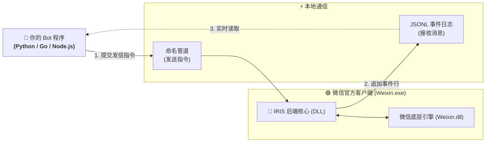

<div align="center">

# 🤖 IRIS — 微信机器人原生后端

### 收消息、发消息，用任何语言写你的 Bot

[](https://microsoft.com)
[](https://weixin.qq.com/)
[](#-它怎么工作)
[](#-快速上手)
[](LICENSE)

<p align="center">
  <b>轻量级 C++ 后端</b><br>
  运行在微信进程内，通过本地管道与 JSONL 日志提供完整收发能力
</p>

</div>

---

## ⚠️ 使用前必读

**运行要求**

| 项目 | 要求 |
| :--- | :--- |
| 操作系统 | Windows x64 |
| 微信版本 | **仅支持 4.1.13.12**（版本不符会拒绝加载） |
| 运行库 | Microsoft Visual C++ 2015-2022 可再发行组件 (x64) |
| 启动前提 | 启动前微信必须**完全退出** |

**仅在从源码构建时才需要**

| 项目 | 要求 |
| :--- | :--- |
| 编译器 | Visual Studio 2022 / MSVC v143 x64（C++20） |
| CMake | ≥ 3.23 |
| 版本 Profile | **需单独下载**——含逆向得到的 RVA，不随仓库分发，见[微信版本 Profile](docs/profile.md) |

> [!NOTE]
> 直接使用 [Releases](https://github.com/mnasthai/IRIS/releases) 里的预编译版**不需要**编译器和 Profile——适配数据已经编译在 `IRIS.dll` 内。

> [!CAUTION]
> 本项目通过底层技术与微信客户端交互，属于**第三方非官方**研究项目。使用可能导致账号受限等风险，全部风险由使用者自行承担。请先阅读文末[免责声明](#-免责声明)。

---

## 🌟 它能做什么

- 💬 **消息双向收发** —— 实时监听私聊与群聊消息，并可主动发送文本；
- 👥 **群聊深度支持** —— 群内 `@` 成员强提醒、引用历史消息回复；
- 🖼️ **多媒体自动落盘** —— 收到的图片与语音自动保存到本地，方便直接交给大模型；
- 📤 **多媒体主动发送** —— 发送本地图片与语音文件；
- 🔌 **跨语言开箱即用** —— 只用命名管道和 JSON 文件，Python / Go / Node.js / Rust 都能接入；
- 🐍 **Python 免写协议层** —— 官方 Python 运行时 **[Plux](https://github.com/mnasthai/Botplux)** 已封装组帧、握手、能力探测、幂等去重、有效期与结果分类，**业务只写插件，不用自己拼协议**；
- 🛡️ **原生稳定** —— 基于微信官方桌面端运行，不依赖网页版协议。

---

## 🗺️ 它怎么工作



**收消息**：后端在微信进程内监听消息到达，把每条消息追加成一行 JSON 写入日志文件，你的程序只需顺序读取这个文件。

**发消息**：你的程序连上本地命名管道，提交一条 JSON 指令，后端在微信自己的 UI 线程上完成发送并把结果回写给你。

---

## ⚡ 快速上手

> [!TIP]
> **不想编译？** 直接从 [**Releases**](https://github.com/mnasthai/IRIS/releases) 下载 `IRIS-v0.1.0-win-x64.zip`，解压即用——**适配数据已编译在 `IRIS.dll` 内，不需要任何额外文件**，也不需要装编译器。
>
> 下面是从源码构建的完整流程。

### 第 1 步：编译

**先下载版本 Profile**（含逆向得到的 RVA，不随仓库分发）：

> **网盘链接**：https://pan.baidu.com/s/1EYrobx6mqF8CsZrSXPYe_A
>
> **提取码**：`2e5s`
>
> 下载后把 `weixin-4.1.13.12.json` 放进仓库的 `profile/` 目录。
> 详见 [微信版本 Profile](docs/profile.md)。

```powershell
git clone https://github.com/mnasthai/IRIS.git
cd IRIS
# 把下载到的 profile JSON 放进 profile/ 目录
.\build.ps1
```

脚本会自动定位工具链并完成配置与构建。加 `-Test` 可同时跑离线测试。

> [!IMPORTANT]
> 缺少 Profile 时配置阶段会直接报错并给出指引，不会静默产出一个装错了偏移的 DLL。

产物在 `build\release\bin\Release\`：

| 文件 | 用途 |
| :--- | :--- |
| `IRIS-launcher.exe` | 启动器：拉起微信并注入后端 |
| `IRIS.dll` | 实际注入微信的后端模块 |
| `IRIS-tests.exe` | 离线测试宿主，不需要微信 |
| `IRIS-launcher-tests.exe` | 启动器测试：路径解析与模块加载 |

> 详细构建说明（CMake 预设、构建选项、故障排查）见 [构建与编译](docs/building.md)。

### 第 2 步：配置并启动

发信能力**默认关闭**，必须显式打开。以下是最小可用配置：

```powershell
# 必填：当前登录微信的 wxid（用于防止切号误发）
$env:WECHATBOT_SEND_ACCOUNT   = 'wxid_你的账号'

# 打开命令管道与原生发信
$env:WECHATBOT_COMMAND_PIPE   = '1'
$env:WECHATBOT_NATIVE_SEND    = '1'

# 持续发送模式 + 允许发送的目标白名单（分号分隔）
$env:WECHATBOT_SEND_MODE      = 'continuous'
$env:WECHATBOT_SEND_TARGETS   = 'wxid_好友A;12345678@chatroom'

# 可选：微信不在默认安装位置时指定路径
$env:WECHATBOT_WEIXIN_EXE     = '<微信安装目录>\Weixin.exe'

# 启动（会拉起微信并完成注入）
.\build\release\bin\Release\IRIS-launcher.exe
```

启动成功后，日志写在 `<仓库根目录>\runtime\observer-4.1.13.12.jsonl`。

> 全部环境变量（媒体开关、引用回复、诊断追踪等）见 `include/monitor/config/IRISconfig.hpp` 与 `src/config/IRISconfig.cpp`。

### 第 3 步：写你的 Bot

**推荐：直接用官方 Python 运行时 [Plux](https://github.com/mnasthai/Botplux)**，不必自己写协议层。组帧、`hello` 握手、能力门禁、幂等去重、有效期、重试与送达证据都由框架处理，**业务只写插件**：

```python
class HelloPlugin(Plugin):
    manifest = PluginManifest("hello")

    def register(self, registry):
        registry.command(CommandSpec("hello", "/hello", self.hello))

    def hello(self, argument, context):
        return respond(context, text="你好")
```

> [!TIP]
> Plux 需要 **Python 3.11+，且零第三方依赖**（只用标准库）。它同样锁 `4.1.13.12`版本，命令管道名从 `command_pipe_ready` 事件自动发现，无需手填。
> 安装、配置与首次运行见 [Plux 快速上手](https://github.com/mnasthai/Botplux/blob/main/docs/guide/getting-started.md)。

<details>
<summary><b>不想引入任何依赖？展开看纯标准库手写的完整示例（协议的全部细节）</b></summary>

```python
import json, os, struct, time

# 换成你自己的 runtime 目录（默认是仓库根目录下的 runtime）
RUNTIME   = r"<仓库根>\runtime"
LOG       = os.path.join(RUNTIME, "observer-4.1.13.12.jsonl")

def read_exact(pipe, size):
    data = b""
    while len(data) < size:
        chunk = pipe.read(size - len(data))
        if not chunk:
            raise IOError("pipe closed")
        data += chunk
    return data

def call(pipe_name, request):
    """一次请求 = 一次连接：写 4 字节小端长度 + JSON，再读回同样格式的响应"""
    payload = json.dumps(request, ensure_ascii=False).encode("utf-8")
    with open(pipe_name, "r+b", buffering=0) as pipe:
        pipe.write(struct.pack("<I", len(payload)))
        pipe.write(payload)
        length = struct.unpack("<I", read_exact(pipe, 4))[0]
        return json.loads(read_exact(pipe, length).decode("utf-8"))

def send_text(pipe_name, session, account, target, text):
    now = time.gmtime()
    return call(pipe_name, {
        "op": "send_text", "protocol_version": 1,
        "request_id": f"msg-{int(time.time() * 1000)}", "attempt_id": "att-1",
        "observer_session_id": session, "expected_account_id": account,
        "target_id": target, "text": text,
        "created_at":  time.strftime("%Y-%m-%dT%H:%M:%SZ", now),
        "expires_at":  time.strftime("%Y-%m-%dT%H:%M:%SZ", time.gmtime(time.time() + 60)),
        "origin": "manual", "source_event_key": None,
    })

# 等待日志出现
while not os.path.exists(LOG):
    time.sleep(0.2)

pipe_name = session = None
with open(LOG, "r", encoding="utf-8", errors="replace") as log:
    log.seek(0, os.SEEK_END)
    print("🤖 已启动，正在监听消息…")
    while True:
        line = log.readline()
        if not line:
            time.sleep(0.05)
            continue
        try:
            event = json.loads(line)
        except json.JSONDecodeError:
            continue

        # 1) 握手：拿到管道名与会话 ID
        if event.get("kind") == "command_pipe_ready":
            pipe_name = event["pipe"]          # 已经是完整的 \\.\pipe\... 路径
            session   = event["session_id"]

        # 2) 收到新消息
        elif event.get("kind") == "item" and event.get("msg_type") == 1:
            conversation = event.get("from")          # 回复要发回这里
            content      = event.get("content", "")
            sender       = conversation
            if conversation.endswith("@chatroom") and ":\n" in content:
                sender, content = content.split(":\n", 1)   # 群聊：拆出真实发言人
            print(f"[{sender}] {content}")

            if pipe_name and not content.startswith("🤖"):
                result = send_text(pipe_name, session, "wxid_你的账号",
                                   conversation, f"🤖 收到：{content}")
                print("  ↳", result["status"], result.get("error_code") or "")
```

运行它（改好 `RUNTIME` 与账号 wxid），在微信里给这个账号发一条消息即可看到自动回复。

> [!NOTE]
> 持续模式默认带 1 秒发送间隔冷却，回复过快会拿到 `rate_limited`。
> 响应中的 `status` 为 `unknown` 时，表示后端已进入原生调用但结果不可知，**严禁自动重试**，否则可能重复发送。

</details>

---

## 🧭 文档导航

### 🤖 给 Bot 开发者

| 文档 | 内容 |
| :--- | :--- |
| 🔌 **[命令管道协议](docs/protocol.md)** | 发信接口：分帧、5 个操作、字段约束、状态语义、错误码全表 |
| 📜 **[事件日志协议](docs/events.md)** | 收信接口：JSONL 事件种类、字段含义、读取诊断、丢事件告警 |
| ⚙️ **[运行配置](docs/configuration.md)** | 全部环境变量、目录布局、单次与持续模式、启动与停机行为 |
| 🧯 **[疑难排查](docs/troubleshooting.md)** | 发不出消息、连不上管道、看不到事件 |

### 🔧 给 C++ / 逆向开发者

| 文档 | 内容 |
| :--- | :--- |
| 💡 **[内部架构](docs/architecture.md)** | 注入与 Hook 链、内存安全模型、UI 线程调度、发信分层、停机顺序 |
| 🔐 **[微信版本 Profile](docs/profile.md)** | 逆向数据的 JSON 结构、构建期代码生成、适配新微信版本 |
| 🛠️ **[构建与编译](docs/building.md)** | 工具链要求、CMake 预设与构建选项、工程结构、测试 |
| 🧯 **[疑难排查](docs/troubleshooting.md)** | 构建失败、注入失败、观测不到消息 |

---

## 🧩 配套项目

| 项目 | 说明 |
| :--- | :--- |
| 🐍 **[Plux](https://github.com/mnasthai/Botplux)** | **微信机器人的 Python 运行时**。架在 IRIS 之上，把帧编码、`hello` 握手、能力门禁、幂等去重、有效期、重试与送达证据全部封装掉，并额外提供插件模型、SQLite 事务数据域、内容寻址资产与可恢复的后台任务。要求 Python 3.11+，**零第三方依赖**。 |

**IRIS 与 Plux 的分工**

```
你的业务插件  ──▶  Plux（Python 运行时：协议编排、状态、任务、数据）
                        │  命名管道 + JSONL
                        ▼
                   IRIS（C++ 内核：注入微信、原生收发）
                        │
                        ▼
                   微信桌面端
```

IRIS 只负责"把消息读出来、把消息发出去"这一层，不做业务编排。**如果你用 Python，直接用 Plux 即可，不需要照着本仓库的协议文档手写客户端。**

两者之间的接口由[命令管道协议](docs/protocol.md)与[事件日志协议](docs/events.md)固定，因此你也可以用任何语言自行实现这一层。

---

## 📄 免责声明

> [!CAUTION]
> **请在阅读、使用或二次开发本项目前仔细阅读以下条款。使用本项目即代表您完全理解并同意本声明的所有内容：**
>
> 1. **学术与研究用途**：本项目主要面向学术交流与教学研究。严禁将本项目用于黑灰产、网络欺诈或任何侵犯他人合法权益之行为。
> 2. **商业使用与盈利风险**：GPL-3.0 授予的权利**不排除商业使用**，本项目作者亦未在许可层面限制使用场景；但本项目仅作为个人技术研究项目维护，**不为其任何商业或盈利性使用提供支持、担保、背书或授权**。使用者若将本项目或其衍生作品用于任何盈利目的，须自行确保其行为符合所在司法辖区的法律法规与平台规则，并**独立承担由此产生的全部责任**；作者与代码贡献者不承担任何连带责任。
> 3. **非官方与无关联**："微信"及 "WeChat" 等商标与软件著作权均归深圳市腾讯计算机系统有限公司所有。本项目为独立的第三方个人开源技术研究，与腾讯公司无任何官方关联、合作或背书关系。
> 4. **风险自负与责任豁免**：使用本技术可能存在包括但不限于账号受限、账号封禁、数据异常或客户端意外闪退等潜在风险。开发者及代码贡献者不对因使用、编译、运行或衍生本项目所造成的任何直接、间接或连带法律责任与财产损失承担任何形式的担保与法律连带责任，所有风险由使用者完全自行承担。
> 5. **合规与权益保护**：使用者在下载、编译和运行本项目时，须严格遵守《中华人民共和国网络安全法》、《计算机软件保护条例》及《腾讯微信软件许可及服务协议》等相关法律法规与平台守则。若相关权利方认为本项目涉及任何权益侵犯，请通过平台联系维护者，我们将第一时间积极配合核实并予以处理。

---

## 📜 开源协议与授权

本项目采用 **[GNU General Public License v3.0 (GPL-3.0)](LICENSE)** 开源许可证。

- **自由研习**：允许出于学术研究与技术探讨目的自由查阅、修改与编译本代码；
- **开源传染性**：任何修改、衍生或整合本项目的作品，必须同样以 GPL-3.0 许可证保持完全开源，严禁闭源发布；
- **商用风险自担**：GPL-3.0 并未禁止商业使用，本项目作者也不在许可层面限制使用场景；但本项目不为其商业或盈利性使用提供任何支持、担保或背书，由此产生的全部风险与责任由使用者自行承担，详见[免责声明](#-免责声明)；
- **无担保声明**：代码按"现状"（AS-IS）提供，不包含任何明示或暗示的可用性保证（详见 GPL-3.0 第 15、16 条无担保条款）。

### 🔗 关联平台规范与第三方协议

- 📑 [《腾讯微信软件许可及服务协议》](https://weixin.qq.com/cgi-bin/readtemplate?lang=zh_CN&t=weixin_agreement&s=default)
- 📋 [《微信个人帐号使用规范》](https://weixin.qq.com/cgi-bin/readtemplate?lang=zh_CN&t=weixin_agreement&s=standard)
- ⚖️ [MinHook 第三方组件许可证 (Tsuda Kageyu)](third_party/minhook/LICENSE.txt)
